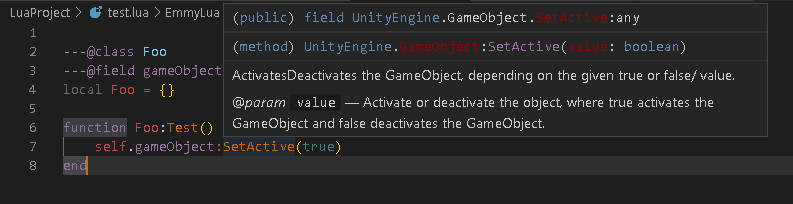
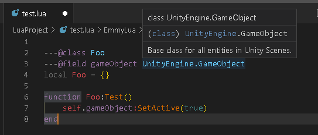
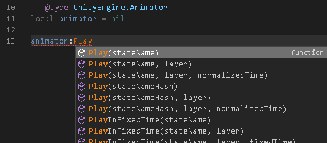
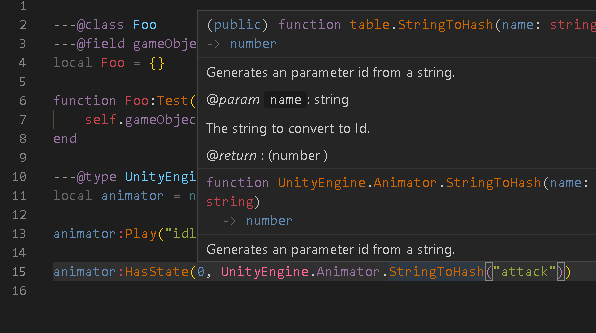

# Unity Lint For EmmyLua

Unity API Document for EmmyLua. EmmyLua用UnityAPI注释文档。

## Package

[UnityLint2019.4.2f.7z](https://github.com/xerysherry/UnityAPIForEmmyLua/raw/main/Packages/UnityLint2019.4.2f.7z)

[UnityLint2019.4.31f1.7z](https://github.com/xerysherry/UnityAPIForEmmyLua/raw/main/Packages/UnityLint2019.4.31f1.7z)

[UnityLint2021.2.7f1.7z](https://github.com/xerysherry/UnityAPIForEmmyLua/raw/main/Packages/UnityLint2021.2.7f1.7z)

## How to Use.

1. Download UnityLint Package or Clone this project.

2. Extract Folder to your lua project directory. Or make soft link to your lua project directory.

Note: Don't require Lint Lua Script！

## How to Generate

[https://github.com/xerysherry/EmmyLuaUnityLintGenerator](https://github.com/xerysherry/EmmyLuaUnityLintGenerator)

## 如何使用

1. 下载API提示包，或者克隆本项目。

2. 解压提示包文件夹到你的lua项目路径，或者使用软链方式到你的Lua项目。

注意：千万不require，或者引用提示包中代码。

## 如何生成

[https://github.com/xerysherry/EmmyLuaUnityLintGenerator](https://github.com/xerysherry/EmmyLuaUnityLintGenerator)

## Screenshot

